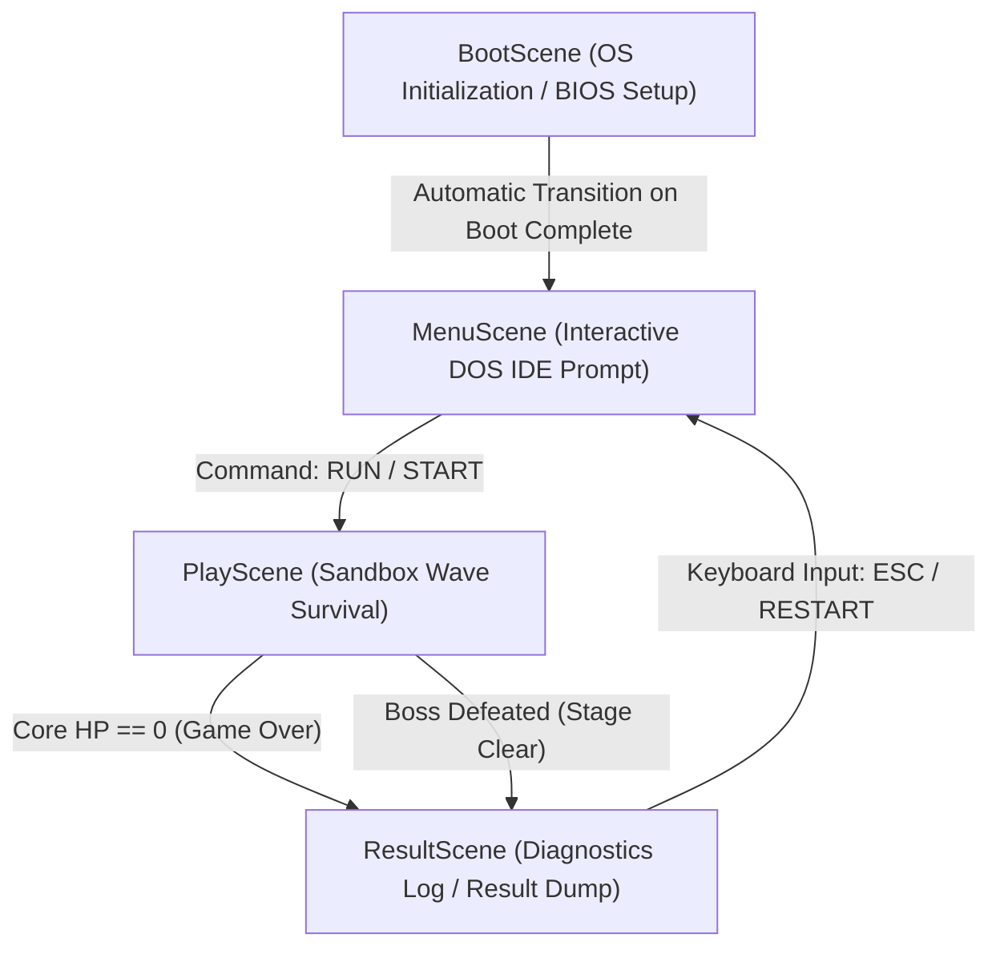

# Jiyoon Debug Survival — Technical Architecture Plan

This document details the software architecture, design decisions, scene workflows, retro styling guides, and stateless simulation mechanics for **Jiyoon Debug Survival (JDS)**. This game is built using a decoupled architecture separating pure logic simulation from Phaser 3's rendering pipeline (AD-002), styled under a high-fidelity retro monochrome ASCII terminal aesthetic (AD-001).

---

## 1. System Topology & Directory Structure

Jiyoon Debug Survival utilizes Vite for development and bundling, TypeScript for strict type checking, and Phaser 3 as the presentation/canvas rendering engine.

### Complete Directory Tree
All files must be saved within the project root. The workspace file organization is defined as follows:

```
C:/Users/user/Desktop/jdy_agy/
├── package.json                    # Node dependencies and scripts
├── tsconfig.json                   # TypeScript configuration
├── index.html                      # Mount point for Vite & terminal wrapper
├── src/
│   ├── main.ts                     # Main entrypoint, handles HTML setup and scene booting
│   ├── style.css                   # Custom global retro terminal CRT/glow stylesheets
│   ├── config.ts                   # Phaser 3 global configurations (canvas size, physics, scaling)
│   ├── scenes/
│   │   ├── BootScene.ts            # Terminal BIOS startup self-test & boot animation scene
│   │   ├── MenuScene.ts            # Monospace Menu supporting interactive stage/weapon setup
│   │   ├── PlayScene.ts            # Play scene connecting input, ticking Simulator, and rendering
│   │   └── ResultScene.ts          # Performance analytics / stack overflow report screen
│   ├── simulator/
│   │   ├── types.ts                # Strong typing interfaces for the simulation engine
│   │   ├── Simulator.ts            # Main game clock, event coordinator, and logic pipeline
│   │   ├── Player.ts               # Player physics state, invulnerability frames, active weapon
│   │   ├── Enemy.ts                # Enemy states (SyntaxError, NullPointer, SegFault, HealBug, Boss)
│   │   ├── Weapon.ts               # Weapon logic loops (Python homing, C++ piercing, Java orbiting shield)
│   │   └── EventManager.ts         # Event system handling spawn timelines & "Indentation Panic"
│   └── renderer/
│       ├── AsciiRenderer.ts        # Maps simulator states to Phaser Text-based glyphs
│       └── PostFXOverlay.ts        # Scanline overlay, screen flicker, and glitch renderer
```

---

## 2. Scene Hierarchy & Transitions

The game follows a strict, unidirectional and loopable Phaser 3 scene sequence:



### Scene Descriptions & Design Specs

### A. BootScene
- **Purpose**: Establishes the retro terminal theme and checks system integrity mock-ups.
- **Aesthetic**: Direct white-on-black or green-on-black monospace log dumps.
- **Visual Script**:
  1. Flickering block cursor `█`.
  2. Sequential line output printing at randomized quick intervals:
     ```
     JDS BIOS v1.0.4 - BOOT RECORD OK
     CPU: JIYOON CORE DUO @ 3.33GHz
     RAM: 640KB SYSTEM CONVENTIONAL MEMORY
     VERIFYING SECTOR 0x00F8... SUCCESS
     INITIALIZING COMPILER PARSER LIBRARIES... SUCCESS
     COMPILING STACK OVERFLOW SANITIZERS... SUCCESS
     [WARNING] CRITICAL CORRUPTION FOUND IN DIRECTORY: /src/sandbox/
     [WARNING] INTRUSION PATTERNS IDENTIFIED: BUGS_DELUGE_V2026
     
     READY FOR LIVE DEBUGGING INJECTOR.
     [ PRESS ANY KEY TO INITIALIZE IDE_SANDBOX.EXE ]
     ```
  3. Listening to any keydown event to trigger a screen-glitch wipe and transition to `MenuScene`.

### B. MenuScene
- **Purpose**: Interactive setup screen for Stage and Weapon selection.
- **Aesthetic**: Neon amber/neon green retro BIOS configuration panel or terminal command shell.
- **Selection Parameters**:
  - **Stage Selection**:
    - `STAGE 1: MAIN_LOOP_CORRUPTION` (60s timer, basic wave spawns, Boss: Jang Seonhyeong).
    - `STAGE 2: HEAP_LEAK_INFERNO` (Hard Mode: 2x spawn rate, Boss: Jang Seonhyeong with dual shields).
  - **Weapon Selection**:
    1. `PYTHON.PY` (Homing scripts targeting nearest bug).
    2. `CPP.CPP` (High-speed, high-piercing line beams).
    3. `JAVA.CLASS` (Defensive orbiting shield blocks).
- **Control Interface**: Monospace keys navigation (`W`/`S` or `UP`/`DOWN` to traverse parameters, `A`/`D` or `LEFT`/`RIGHT` to toggle selection state, and `ENTER` or `SPACE` to run). Includes a detailed ASCII border display card explaining weapon stats.

### C. PlayScene
- **Purpose**: Runs the real-time wave survival sandbox logic.
- **Execution Flow**:
  - Sets up Phaser rendering window size: standard retro **800x600 px** canvas.
  - Instantiates the `Simulator` core engine.
  - Generates the initial text-based game grid.
  - Handles continuous user keystrokes (`WASD` / `Arrow Keys`) and sends them directly to the `Simulator`.
  - Performs `simulator.tick(dt, inputs)` in the `update()` tick callback.
  - Translates current simulator positions directly into corresponding ASCII sprites.
  - Renders the terminal diagnostics HUD panel on the side of the arena.

### D. ResultScene
- **Purpose**: Displays diagnostic logs detailing the survival success or heap overflow failure.
- **Details Logged**:
  - Outcome Status (e.g. `[ STATUS: COMPILATION SUCCESSFUL ]` or `[ STATUS: RUNTIME_ERROR: STACK_OVERFLOW ]`).
  - Total Survival Duration.
  - Total Bugs Resolved (Kill Count).
  - Selected Weapon efficiency statistics.
  - Interactive retro terminal prompts: `[R] RECOMPILE SANDBOX` / `[ESC] RETURN TO IDE SHELL`.

---

## 3. Retro Terminal UI/UX & Aesthetics

To maintain absolute compliance with the aesthetic constraints, JDS uses specific typography, color scales, and CRT filters.

### Palette Architecture
Strict HSL color values are standardized across the code to allow dynamic glow calculations:
- **Background Core**: `hsl(0, 0%, 3%)` (Deep Obsidian Black)
- **Primary Terminal Green**: `hsl(120, 100%, 48%)` (Vibrant Neon Green)
- **Terminal Amber**: `hsl(35, 100%, 50%)` (Warm Amber Glow)
- **Alert Red**: `hsl(0, 100%, 50%)` (Intense Warning Red)
- **Diagnostics White**: `hsl(0, 0%, 90%)` (Clean High-Contrast Terminal Text)

### Visual Overlay Elements
1. **Fonts**: Standardized on CSS monospace system fallbacks (`Courier New`, `Consolas`, `Fira Code`, `monospace`). Ensure anti-aliasing is disabled on fonts (`image-rendering: pixelated`) to maximize the blocky retro terminal look.
2. **Scanline Layer**: A persistent HTML/CSS overlay div tracking transparent repeating gradients:
   ```css
   .scanlines {
       position: absolute;
       top: 0; left: 0; width: 100%; height: 100%;
       background: linear-gradient(
           rgba(18, 16, 16, 0) 50%, 
           rgba(0, 0, 0, 0.25) 50%
       );
       background-size: 100% 4px;
       z-index: 1000;
       pointer-events: none;
   }
   ```
3. **Glitch Effects**: Dynamic coordinate offsetting on Text renderers in response to heavy impact (e.g., when player HP decreases, we apply a temporary screen shake + font shear).

---

## 4. AD-002: Stateless Simulator Isolation

The core design principle is **complete separation of state simulation from Phaser 3**. The simulator runs as a pure TypeScript model. It has zero knowledge of Phaser, WebGL, Sprites, or the browser DOM.

```
       +---------------------------------------------+
       |                  PHASER 3                   |
       |                                             |
       |  Reads Inputs  ---->   Instantiates & Ticks |
       | (WASD / Arrows)             Simulator       |
       +-------+---------------------+---------------+
               |                     |
               | Captures            | Queries
               | Input States        | Entity Positions
               v                     v
       +-------+---------------------+---------------+
       |             PURE TS SIMULATOR               |
       |                                             |
       |  • Player Coordinates, HP, Invuln Timer    |
       |  • Enemy Spawners & AI Vectors              |
       |  • Projectile Trajectories & Hits           |
       |  • Pure Math Boundary Constraints           |
       +---------------------------------------------+
```

### Simulator Interfaces (`src/simulator/types.ts`)

No placeholders are permitted in interfaces. The exact complete interface typing is specified below:

```typescript
export interface Position {
    x: number;
    y: number;
}

export interface Velocity {
    vx: number;
    vy: number;
}

export type WeaponType = 'PYTHON' | 'CPP' | 'JAVA';

export type EnemyType = 'SYNTAX_ERROR' | 'NULL_POINTER' | 'SEG_FAULT' | 'HEAL_BUG' | 'BOSS';

export interface PlayerInput {
    up: boolean;
    down: boolean;
    left: boolean;
    right: boolean;
}

export interface SimPlayer {
    x: number;
    y: number;
    vx: number;
    vy: number;
    radius: number;
    maxHp: number;
    hp: number;
    speed: number;
    activeWeapon: WeaponType;
    invulnerableTimer: number;
}

export interface SimEnemy {
    id: string;
    type: EnemyType;
    x: number;
    y: number;
    vx: number;
    vy: number;
    hp: number;
    maxHp: number;
    speed: number;
    radius: number;
    damage: number;
    customAIState?: number; // Used for fleeing logic or boss patterns
}

export interface SimProjectile {
    id: string;
    type: WeaponType;
    x: number;
    y: number;
    vx: number;
    vy: number;
    damage: number;
    radius: number;
    pierceRemaining: number;
    homingTargetId?: string; // Used for homing projectiles (Python)
    angle?: number; // Used for orbiting projectiles (Java)
}

export interface SimItem {
    id: string;
    x: number;
    y: number;
    radius: number;
    healAmount: number;
}

export interface SimEvent {
    id: string;
    triggerTime: number;
    name: string;
    triggered: boolean;
}

export interface SimState {
    width: number;
    height: number;
    player: SimPlayer;
    enemies: SimEnemy[];
    projectiles: SimProjectile[];
    items: SimItem[];
    gameTimer: number;
    killCount: number;
    bossSpawned: boolean;
    bossDefeated: boolean;
    isStageClear: boolean;
    isGameOver: boolean;
    stageSelection: number; // 1 = Main Loop Corruption, 2 = Heap Leak Inferno
}
```

### Core Simulator Class (`src/simulator/Simulator.ts`)

The Simulator manages entity spawns, ticks timers, and evaluates pure numerical boundary collisions:

- **Initialization**: Configures base boundaries (e.g., `width = 800`, `height = 600`), default player, selected weapon, and spawn timelines.
- **Ticking (`tick(dt: number, input: PlayerInput)`)**:
  1. **Player Movement & Canvas Clamping**:
     - Calculates target velocities based on keyboard input states.
     - Clamps player positions between coordinate boundaries (`[radius, width - radius]` for X and `[radius, height - radius]` for Y) preventing the player from moving outside the terminal window canvas (AC202).
  2. **Weapon Execution Logic**:
     - Reduces weapon firing cooldows.
     - Auto-triggers targeting loops:
       - **Python**: Iterates through `enemies` list, selects the closest one, and launches homing projectiles directed at target coordinates.
       - **C/C++**: Fires high-velocity straight-line beams targeting the nearest enemy at the moment of firing. Projectiles have a high penetration counter (`pierce = 5`).
       - **Java**: Spawns and maintains orbiting shields whose coordinates rotate mathematically:
         `x = player.x + Math.cos(angle) * orbitRadius`, `y = player.y + Math.sin(angle) * orbitRadius`.
  3. **Enemy AI Update Cycle**:
     - **SyntaxError**: Basic path tracking towards current `player.x`, `player.y`.
     - **NullPointer**: High movement speed straight tracker with very low health.
     - **SegFault**: Tanker profile. Moves slowly, tracks player, inflicts massive contact damage on contact.
     - **HealBug**: Fleeing pattern. Calculates standard normalized direction vector pointing away from player, fleeing active danger zone.
     - **Boss (Jang Seonhyeong)**: Spawns at 60s. Circles player, spawning slow defensive syntax shields or direct target bursts.
  4. **Collision Resolution Operations**:
     - Pure mathematical circular collision calculations: `dx * dx + dy * dy < (r1 + r2) * (r1 + r2)`.
     - Resolves Projectile vs Enemy collisions: inflicts weapon damage, reduces pierce counts, triggers HealBug drop generation on enemy demise.
     - Resolves Enemy vs Player collisions: triggers invulnerable timers if hit, decreases core health.
     - Resolves Item vs Player collisions: processes healing inputs.
  5. **Spawner Timelines**:
     - Checks game timers and spawns corresponding waves.
     - Spawns stage-specific events: triggers "Indentation Panic" at exactly 30 seconds (AC405) by spawning a wave of 15-20 small basic syntax trackers instantly.
     - Spawns Rival Boss Jang Seonhyeong at exactly 60 seconds (AC501).

---

## 5. Architectural Verification & Testing Strategy

Because the simulation logic is strictly stateless and free of Phaser classes, we can run high-coverage unit tests without loading browser screens.

### Sample Automated Test Implementation (`tests/test_simulation.ts`)
The simulator structure allows full verification of game rules using standard CLI runners:

```typescript
import { Simulator } from '../src/simulator/Simulator';
import { PlayerInput } from '../src/simulator/types';

export function runSimulationTestSuite() {
    console.log("[TEST] Beginning Simulator Isolation Tests...");

    // Setup simulator representing Stage 1 with Python weapon
    const sim = new Simulator({
        width: 800,
        height: 600,
        stage: 1,
        weapon: 'PYTHON'
    });

    // 1. Verify Player Movement & Boundary Constraints
    const inputRight: PlayerInput = { up: false, down: false, left: false, right: true };
    
    // Tick 10 frames moving right
    for (let i = 0; i < 10; i++) {
        sim.tick(16.67, inputRight); // Approx 60 FPS tick
    }
    
    console.assert(sim.state.player.x > 400, "Player should have moved right from standard center point");

    // Test extreme boundary clamping
    const inputExtremes: PlayerInput = { up: false, down: false, left: false, right: true };
    for (let i = 0; i < 500; i++) {
        sim.tick(16.67, inputExtremes);
    }
    console.assert(sim.state.player.x === 800 - sim.state.player.radius, "Player X coordinates must be strictly clamped inside canvas width");

    // 2. Verify Spawning and Timers
    sim.state.gameTimer = 29.98; // Position timer just before Indentation Panic
    sim.tick(30, { up: false, down: false, left: false, right: false });
    
    console.assert(
        sim.state.enemies.length > 5, 
        "Indentation Panic event must spawn dynamic group of basic trackers at 30 seconds"
    );

    // 3. Verify Boss Spawn Schedule
    sim.state.gameTimer = 59.98; // Position timer just before Boss event
    sim.tick(30, { up: false, down: false, left: false, right: false });
    console.assert(sim.state.bossSpawned, "Boss Jang Seonhyeong must spawn precisely at 60 seconds");

    console.log("[TEST] Simulator Isolation Tests Passed Successfully!");
}
```

This strict architectural separation ensures robust delivery, preventing UI rendering glitches from corrupting core wave survival game state computations.
