# Ouroboros Lite Double Diamond Execution Plan

## Executive Summary

**Primary Goal (Title):** Jiyoon Debug Survival
**Description:** A 2D wave survival action game set in a corrupted IDE where programming bugs are monsters, featuring customized character portraits and clean aesthetics.

### Planning Metrics
- **Total Acceptance Criteria (Tasks):** 28
- **Total Parallel Execution Levels:** 5
- **Concurrency Factor (Avg Tasks/Level):** 5.60
- **Execution Mode:** Parallel (Topological Sort optimized)

### System Constraints
- Phaser 3 framework must be used for all scene management and rendering pipelines.
- All graphics should use retro ASCII / terminal visual aesthetic styles.
- Game must execute perfectly inside standard modern browsers without native installs.
- No Placeholders: Core implementation contains no stub code, TODOs, comments containing placeholder phrases, or empty ellipses (...).

## Dependency Visualization

```mermaid
graph TD
    AC100["AC100: The game starts from a Monospace/Terminal style..."]
    AC101["AC101: Menu provides 'Start Game', 'Stage Selection', ..."]
    AC100 --> AC101
    AC102["AC102: Terminal boot-up sequence animation plays upon ..."]
    AC100 --> AC102
    AC103["AC103: Weapon Selection screen displays stats and desc..."]
    AC100 --> AC103
    AC104["AC104: Result Screen correctly handles Game Over and S..."]
    AC100 --> AC104
    AC200["AC200: The active play field is controlled by keyboard..."]
    AC201["AC201: Arrow keys and WASD shift the player character ..."]
    AC200 --> AC201
    AC202["AC202: Collision boundaries prevent the player from mo..."]
    AC200 --> AC202
    AC203["AC203: The player avatar is locked to 'player_alt3.png..."]
    AC200 --> AC203
    AC204["AC204: Level-up triggers a card selection overlay (Vam..."]
    AC200 --> AC204
    AC205["AC205: Monsters drop 'Log' File Chips for XP and speci..."]
    AC200 --> AC205
    AC300["AC300: Weapons execute auto-fire cycles targeting loca..."]
    AC200 --> AC300
    AC301["AC301: Python Weapon: Automatic firing of home-in shot..."]
    AC300 --> AC301
    AC302["AC302: C/C++ Weapon: Fast, straight line piercing proj..."]
    AC300 --> AC302
    AC303["AC303: Java Weapon: Orbiting defensive shield rotating..."]
    AC300 --> AC303
    AC400["AC400: Enemy spawn waves and behavior models are activ..."]
    AC200 --> AC400
    AC401["AC401: SyntaxError basic tracker: pursues player coord..."]
    AC400 --> AC401
    AC402["AC402: NullPointer fast tracker: high movement speed, ..."]
    AC400 --> AC402
    AC403["AC403: SegFault heavy tanker: slow movement speed, hig..."]
    AC400 --> AC403
    AC404["AC404: HealBug fleeing support: flees from player, dro..."]
    AC400 --> AC404
    AC405["AC405: Stage Event 'Indentation Panic': triggers at 30..."]
    AC400 --> AC405
    AC500["AC500: Stage Clear Boss Event."]
    AC200 --> AC500
    AC501["AC501: Rival Debug Boss 'Jang Seonhyeong' spawns preci..."]
    AC500 --> AC501
    AC502["AC502: Boss AI features Phase Branching (Phase 1 geome..."]
    AC501 --> AC502
    AC503["AC503: Defeating the Boss halts basic spawns and trigg..."]
    AC502 --> AC503
    AC600["AC600: Game HUD and retro diagnostics display."]
    AC601["AC601: HUD panels track HP, game timer, kill count, cu..."]
    AC600 --> AC601
    AC602["AC602: Background is locked to premium clean gradient ..."]
    AC600 --> AC602
```

## Double Diamond Phase Breakdown

The Double Diamond consists of four stages: Discover (understanding the problem), Define (scope and specifications), Design (technical and UI architecture), and Deliver (implementation and evaluation).

### Phase: Discover
*Initial research, requirement gathering, and Socratic clarification of goals.*

| Task ID | Level | Description | Dependencies |
| --- | --- | --- | --- |
| `AC100` | L1 | The game starts from a Monospace/Terminal styled menu scene. | `None` |
| `AC200` | L1 | The active play field is controlled by keyboard controls with customized avatar. | `None` |
| `AC600` | L1 | Game HUD and retro diagnostics display. | `None` |
| `AC101` | L2 | Menu provides 'Start Game', 'Stage Selection', and 'Weapon Selection' command inputs. | `AC100` |
| `AC102` | L2 | Terminal boot-up sequence animation plays upon launching the game. | `AC100` |
| `AC103` | L2 | Weapon Selection screen displays stats and descriptions of the 3 starting weapons. | `AC100` |
| `AC104` | L2 | Result Screen correctly handles Game Over and Stage Clear states. | `AC100` |
| `AC201` | L2 | Arrow keys and WASD shift the player character continuously in 2D space. | `AC200` |
| `AC202` | L2 | Collision boundaries prevent the player from moving outside the terminal window canvas. | `AC200` |
| `AC203` | L2 | The player avatar is locked to 'player_alt3.png' based on photo portrait. | `AC200` |
| `AC204` | L2 | Level-up triggers a card selection overlay (Vampire Survivors style) pausing the game. | `AC200` |
| `AC300` | L2 | Weapons execute auto-fire cycles targeting local bug monsters. | `AC200` |
| `AC500` | L2 | Stage Clear Boss Event. | `AC200` |
| `AC601` | L2 | HUD panels track HP, game timer, kill count, current weapon, and active event/boss status in terminal theme. | `AC600` |
| `AC602` | L2 | Background is locked to premium clean gradient 'bg_alt1.png' avoiding messy visual clutter. | `AC600` |

### Phase: Define
*Scoping, boundary definition, constraint cataloging, and precise spec definition.*

| Task ID | Level | Description | Dependencies |
| --- | --- | --- | --- |
| `AC205` | L2 | Monsters drop 'Log' File Chips for XP and special items like Clear Cache and Safe Mode. | `AC200` |
| `AC400` | L2 | Enemy spawn waves and behavior models are active in the arena. | `AC200` |
| `AC301` | L3 | Python Weapon: Automatic firing of home-in shots targeting the nearest bug monster. | `AC300` |
| `AC302` | L3 | C/C++ Weapon: Fast, straight line piercing projectile representing direct debugging. | `AC300` |
| `AC303` | L3 | Java Weapon: Orbiting defensive shield rotating around the player character. | `AC300` |
| `AC401` | L3 | SyntaxError basic tracker: pursues player coordinates, inflicts contact damage. | `AC400` |
| `AC402` | L3 | NullPointer fast tracker: high movement speed, low base health. | `AC400` |
| `AC403` | L3 | SegFault heavy tanker: slow movement speed, high health, high contact damage. | `AC400` |
| `AC404` | L3 | HealBug fleeing support: flees from player, drops HP recovery item on death. | `AC400` |
| `AC405` | L3 | Stage Event 'Indentation Panic': triggers at 30s, spawns a deluge of indentation bugs. | `AC400` |
| `AC501` | L3 | Rival Debug Boss 'Jang Seonhyeong' spawns precisely at 60 seconds of survival. | `AC500` |

### Phase: Design
*Technical blueprinting, data modeling, algorithm design, and UI architecture.*

| Task ID | Level | Description | Dependencies |
| --- | --- | --- | --- |
| `AC502` | L4 | Boss AI features Phase Branching (Phase 1 geometric radiant error fire; Phase 2 red glitch dash attacks). | `AC501` |

### Phase: Deliver
*Implementation, test-driven validation, and final mechanical and semantic compliance check.*

| Task ID | Level | Description | Dependencies |
| --- | --- | --- | --- |
| `AC503` | L5 | Defeating the Boss halts basic spawns and triggers Stage Clear transition. | `AC502` |

## Master Step-by-Step Execution Path

Developers or subagents should execute these levels sequentially. However, **all tasks within a single level can be executed concurrently** because their dependencies have been satisfied.

### Level 1
*(Parallel execution enabled: **3** concurrent tasks)*

- [ ] **`AC100`** [Discover]: The game starts from a Monospace/Terminal styled menu scene.
- [ ] **`AC200`** [Discover]: The active play field is controlled by keyboard controls with customized avatar.
- [ ] **`AC600`** [Discover]: Game HUD and retro diagnostics display.

### Level 2
*(Parallel execution enabled: **14** concurrent tasks)*

- [ ] **`AC101`** [Discover]: Menu provides 'Start Game', 'Stage Selection', and 'Weapon Selection' command inputs. (requires AC100)
- [ ] **`AC102`** [Discover]: Terminal boot-up sequence animation plays upon launching the game. (requires AC100)
- [ ] **`AC103`** [Discover]: Weapon Selection screen displays stats and descriptions of the 3 starting weapons. (requires AC100)
- [ ] **`AC104`** [Discover]: Result Screen correctly handles Game Over and Stage Clear states. (requires AC100)
- [ ] **`AC201`** [Discover]: Arrow keys and WASD shift the player character continuously in 2D space. (requires AC200)
- [ ] **`AC202`** [Discover]: Collision boundaries prevent the player from moving outside the terminal window canvas. (requires AC200)
- [ ] **`AC203`** [Discover]: The player avatar is locked to 'player_alt3.png' based on photo portrait. (requires AC200)
- [ ] **`AC204`** [Discover]: Level-up triggers a card selection overlay (Vampire Survivors style) pausing the game. (requires AC200)
- [ ] **`AC205`** [Define]: Monsters drop 'Log' File Chips for XP and special items like Clear Cache and Safe Mode. (requires AC200)
- [ ] **`AC300`** [Discover]: Weapons execute auto-fire cycles targeting local bug monsters. (requires AC200)
- [ ] **`AC400`** [Define]: Enemy spawn waves and behavior models are active in the arena. (requires AC200)
- [ ] **`AC500`** [Discover]: Stage Clear Boss Event. (requires AC200)
- [ ] **`AC601`** [Discover]: HUD panels track HP, game timer, kill count, current weapon, and active event/boss status in terminal theme. (requires AC600)
- [ ] **`AC602`** [Discover]: Background is locked to premium clean gradient 'bg_alt1.png' avoiding messy visual clutter. (requires AC600)

### Level 3
*(Parallel execution enabled: **9** concurrent tasks)*

- [ ] **`AC301`** [Define]: Python Weapon: Automatic firing of home-in shots targeting the nearest bug monster. (requires AC300)
- [ ] **`AC302`** [Define]: C/C++ Weapon: Fast, straight line piercing projectile representing direct debugging. (requires AC300)
- [ ] **`AC303`** [Define]: Java Weapon: Orbiting defensive shield rotating around the player character. (requires AC300)
- [ ] **`AC401`** [Define]: SyntaxError basic tracker: pursues player coordinates, inflicts contact damage. (requires AC400)
- [ ] **`AC402`** [Define]: NullPointer fast tracker: high movement speed, low base health. (requires AC400)
- [ ] **`AC403`** [Define]: SegFault heavy tanker: slow movement speed, high health, high contact damage. (requires AC400)
- [ ] **`AC404`** [Define]: HealBug fleeing support: flees from player, drops HP recovery item on death. (requires AC400)
- [ ] **`AC405`** [Define]: Stage Event 'Indentation Panic': triggers at 30s, spawns a deluge of indentation bugs. (requires AC400)
- [ ] **`AC501`** [Define]: Rival Debug Boss 'Jang Seonhyeong' spawns precisely at 60 seconds of survival. (requires AC500)

### Level 4
*(Parallel execution enabled: **1** concurrent tasks)*

- [ ] **`AC502`** [Design]: Boss AI features Phase Branching (Phase 1 geometric radiant error fire; Phase 2 red glitch dash attacks). (requires AC501)

### Level 5
*(Parallel execution enabled: **1** concurrent tasks)*

- [ ] **`AC503`** [Deliver]: Defeating the Boss halts basic spawns and triggers Stage Clear transition. (requires AC502)
