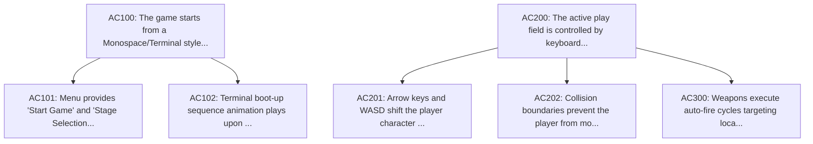

# Ouroboros Lite Double Diamond Execution Plan

## Executive Summary

**Primary Goal (Title):** Jiyoon Debug Survival
**Description:** A 2D wave survival action game set in a corrupted IDE where programming bugs are monsters.

### Planning Metrics
- **Total Acceptance Criteria (Tasks):** 7
- **Total Parallel Execution Levels:** 2
- **Concurrency Factor (Avg Tasks/Level):** 3.50
- **Execution Mode:** Parallel (Topological Sort optimized)

### System Constraints
- Phaser 3 framework must be used for all scene management and rendering pipelines.
- All graphics should use retro ASCII / terminal visual aesthetic styles.
- Game must execute perfectly inside standard modern browsers without native installs.

## Dependency Visualization

## Double Diamond Phase Breakdown

The Double Diamond consists of four stages: Discover (understanding the problem), Define (scope and specifications), Design (technical and UI architecture), and Deliver (implementation and evaluation).

### Phase: Discover
*Initial research, requirement gathering, and Socratic clarification of goals.*

| Task ID | Level | Description | Dependencies |
| --- | --- | --- | --- |
| `AC100` | L1 | The game starts from a Monospace/Terminal styled menu scene. | `None` |
| `AC200` | L1 | The active play field is controlled by keyboard controls. | `None` |

### Phase: Define
*Scoping, boundary definition, constraint cataloging, and precise spec definition.*

*(No tasks assigned to this phase)*

### Phase: Design
*Technical blueprinting, data modeling, algorithm design, and UI architecture.*

| Task ID | Level | Description | Dependencies |
| --- | --- | --- | --- |
| `AC101` | L2 | Menu provides 'Start Game' and 'Stage Selection' command inputs. | `AC100` |
| `AC102` | L2 | Terminal boot-up sequence animation plays upon launching. | `AC100` |
| `AC201` | L2 | Arrow keys and WASD shift the player character continuously in 2D space. | `AC200` |
| `AC202` | L2 | Collision boundaries prevent the player from moving outside the terminal window canvas. | `AC200` |
| `AC300` | L2 | Weapons execute auto-fire cycles targeting local bug monsters. | `AC200` |

### Phase: Deliver
*Implementation, test-driven validation, and final mechanical and semantic compliance check.*

*(No tasks assigned to this phase)*

## Master Step-by-Step Execution Path

Developers or subagents should execute these levels sequentially. However, **all tasks within a single level can be executed concurrently** because their dependencies have been satisfied.

### Level 1
*(Parallel execution enabled: **2** concurrent tasks)*

- [ ] **`AC100`** [Discover]: The game starts from a Monospace/Terminal styled menu scene.
- [ ] **`AC200`** [Discover]: The active play field is controlled by keyboard controls.

### Level 2
*(Parallel execution enabled: **5** concurrent tasks)*

- [ ] **`AC101`** [Design]: Menu provides 'Start Game' and 'Stage Selection' command inputs. (requires AC100)
- [ ] **`AC102`** [Design]: Terminal boot-up sequence animation plays upon launching. (requires AC100)
- [ ] **`AC201`** [Design]: Arrow keys and WASD shift the player character continuously in 2D space. (requires AC200)
- [ ] **`AC202`** [Design]: Collision boundaries prevent the player from moving outside the terminal window canvas. (requires AC200)
- [ ] **`AC300`** [Design]: Weapons execute auto-fire cycles targeting local bug monsters. (requires AC200)
